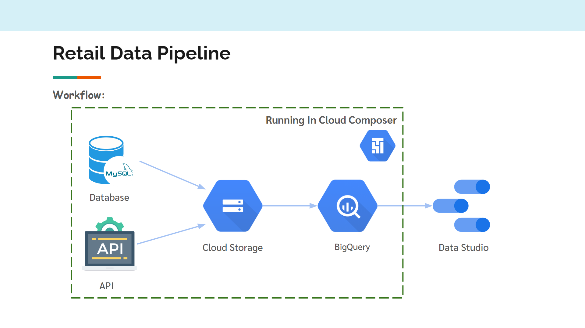
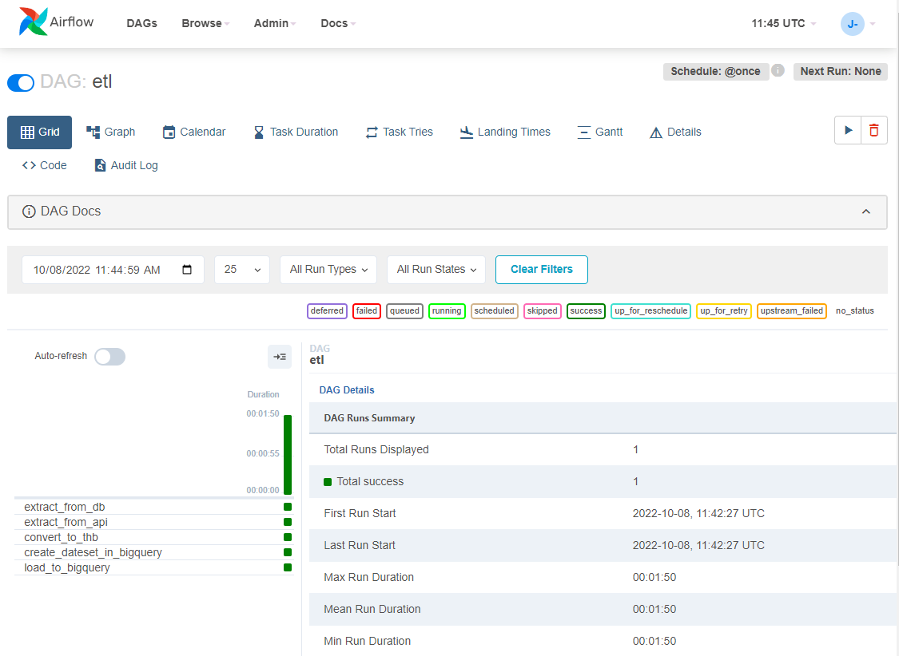
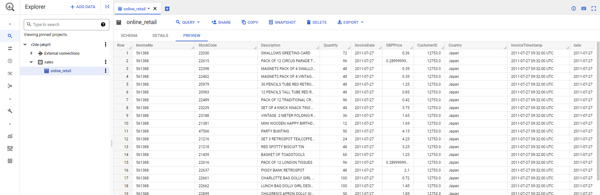

# Simple Retail Pipeline on Google Cloud
The purpose of the project is to learn how to build a Dashboard from scratch on Google Cloud.

## What are we going to do
We're going to create a Dashboard for Online Retailer using the dataset from UC Irvine Machine Learning Repository. 

## Link dataset
https://archive-beta.ics.uci.edu/ml/datasets/online+retail   

Note: You can find information about the dataset in the link.

## Link API
https://gbp-to-thb-4tbescyvrq-ts.a.run.app/ (from simple-flask-app-on-cloud-run project)

## Workflow


The job is to run etl.py in Cloud Composer to Extract data from MySQL Database and API, Clean and Transform data, Store in Cloud Storage, Load into BigQuery, and Create DASHBOARD using Google Data Studio.

## How to do this
Note: To do this you need access to a project that links to Billing Account. (There is Free Trial if you're new to Google Cloud)
<br>

**Step 1:** Get dataset from UC Irvine Machine Learning Repository(UCI) and load into MySQL Database hosting on db4free.net (In test/GetData.ipynb, test/db4free.ipynb)

**Step 2:** Create airflow cluster to run the job [follow the official steps here](https://cloud.google.com/composer/docs/how-to/managing/creating)

**Step 3:** Install Python dependencies [See Documentation](https://cloud.google.com/composer/docs/how-to/using/installing-python-dependencies#install_packages)
- pandas==1.4.3
- requests==2.28.1  

**Step 4:** Create connection in Airflow [See Documentation](https://airflow.apache.org/docs/apache-airflow/stable/howto/connection.html#creating-a-connection-with-the-ui)  

<u>Tip!</u> Put this to your connection in Extra field for function get_records in pipeline to work properly.
```
{"charset": "utf8", "cursor": "dictcursor"}
```

**Step 5:** Upload etl.py from this repo to DAGs folder of your airflow cluster. (Don't forget to change BUCKET_NAME in etl.py)  

<u>Tip!</u> Go to the Environment configuration tab in your cluster details page to get DAGs folder link.

**Step 6:** Point your brower to Airflow web UI and Wait until all tasks is done  

## The result should look like this


**Step 7:** Go to BigQuery to see the result  



**Step 8:** Create DASHBOARD using Google Data Studio    

## Let's see the Result !
Note: All the transactions occurring between 2010-12-01 and 2011-12-09

https://datastudio.google.com/reporting/254e15c0-83d5-4a4a-9c7c-eb09e0420544